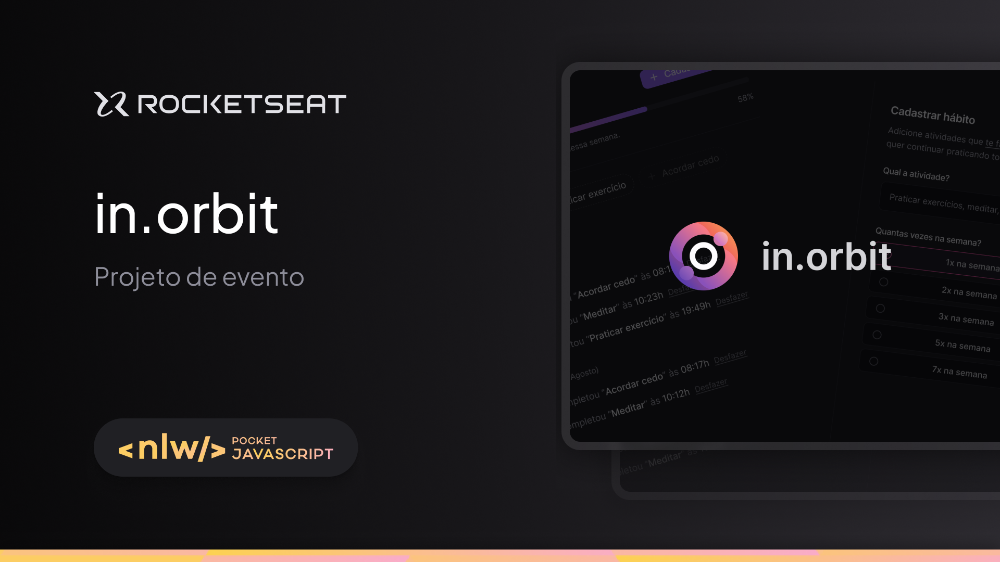
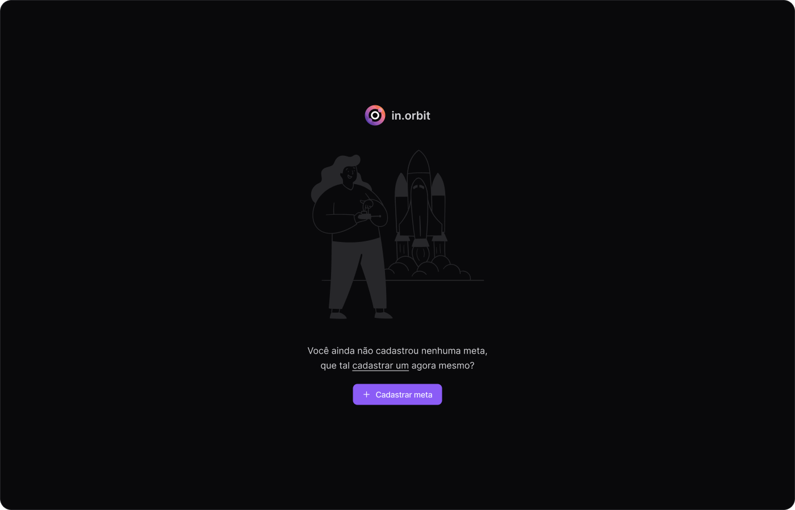
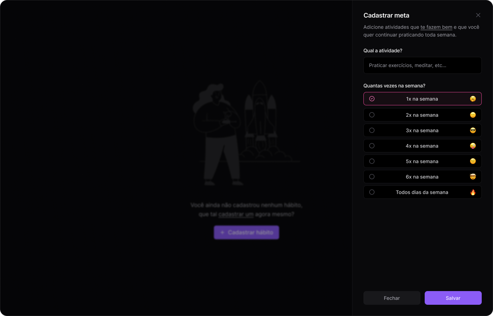
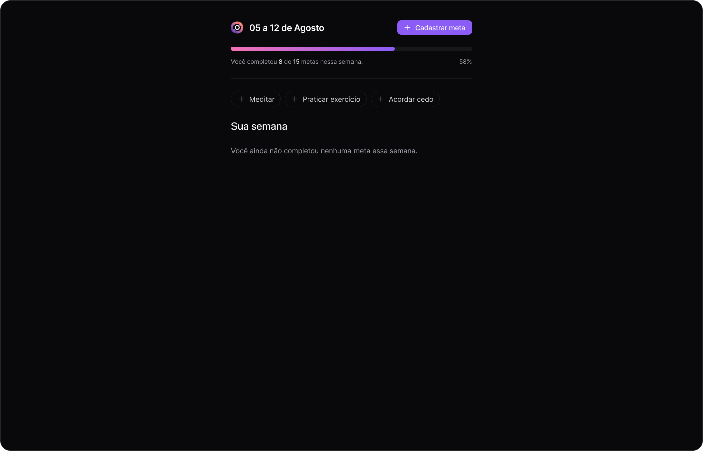
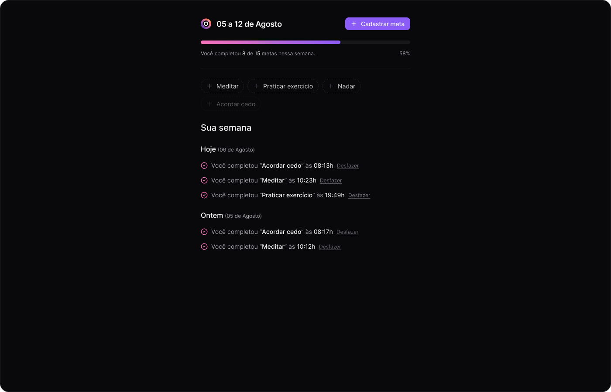

<h1 align="center">
  
</h1>

<p align="center">
  

  

  
  
  <a href="https://github.com/pabloxt14/nlw-pocket-js-in-orbit/commits/master">
    
  </a>
    
   

   <a href="https://github.com/pabloxt14/nlw-pocket-js-in-orbit/stargazers">
    
  </a>
</p>

<p>
  
</p>

<h4 align="center"> 
	🚀 Aplicação finalizada 🚀
</h4>

<p align="center">
 <a href="#-about">About</a> | 
 <a href="#-layout">Layout</a> | 
 <a href="#-api-documentation">API Documentation</a> | 
 <a href="#-setup">Setup</a> | 
 <a href="#-technologies">Technologies</a> | 
 <a href="#-license">License</a>
</p>


## 💻 About

Esta aplicação de nome **in.orbit**, consiste em um site desktop para registro de metas além de contar com um progresso semanal das metas já completadas e das pendentes.

Os principais aprendizados neste projeto foram a implementação de um back-end (API) utilizando o framework `Fastify`, para construção de rotas, requisições HTTP e tratamento de erros, contando também com a utilização do ORM `Drizzle` para a persistência de dados e conexão com o banco de dados. Valendo também apontar o uso de princípios de `SOLID` para a implementação desse back-end.   

Além disso, contou também a implementação da interface front-end utilizando `React + Vite` e da incrivelmente útil biblioteca de "utility classes" (classes utilitárias) `TailwindCSS` para uma fácil estilização de elementos da interface. E para lidar com as requisições na parte do front-end, utilizou-se a biblioteca `React Query`, que apresenta um formato de fetch de dados muito bem estruturado e enxuto, tendo também seu ótimo sistema de cache e reutilização de dados. Ademais, teve-se a aplicação da biblioteca `React Hook Form` para a validação de formulários de uma forma fácil e eficaz.

Todavia, vale ressaltar que essa aplicação foi desenvolvida durante o NLW Pocket JS da [Rocketseat](https://www.rocketseat.com.br/) utilizando principalmente tecnologias como `Node`, `React`, `TypeScript`, `Fastify`, `Drizzle`, `Vite`, `React Query` e `Tailwind`.


<!-- ## 🔗 Deploy

O deploy da aplicação pode ser acessada através da seguinte URL base: https://pabloxt14-nlw-expert-notes.vercel.app/ -->


## 🎨 Layout

Você pode visualizar o layout do projeto através [desse link](https://www.figma.com/community/file/1415093862269754302/nlw-pocket-js-in-orbit). É necessário ter conta no [Figma](https://www.figma.com/) para acessá-lo.

A seguir, veja uma demonstração das principais telas da aplicação:

### Empty

<p align="center">
  
</p>

### Create Goal

<p align="center">
  
</p>

### Goals (empty)

<p align="center">
  
</p>

### Goals (filled)

<p align="center">
  
</p>


## 📚 API Documentation

### POST `/goals`

Cria uma nova meta.

#### Request body

```json
{
  "title": "Nadar",
  "desiredWeeklyFrequency": 3
}
```

### GET `/goals/pending`

Retorna as metas pendentes da semana.

#### Response body

```json
{
  "pendingGoals": [
    {
      "id": "fpn96hcrvd3m2bwiik6560hi",
      "title": "Ler livro",
      "desiredWeeklyFrequency": 5,
      "completionCount": 0
    },
    {
      "id": "gpn96hvrvd3m2bwiik6560hi",
      "title": "Nadar",
      "desiredWeeklyFrequency": 3,
      "completionCount": 0
    }
  ]
}
```

### POST `/goals/{goalId}/completions`

Completar uma frequência de uma meta.

### GET `/summary`

Retorna o resumo sobre as metas da semana.

#### Response body

```json
{
  "summary": {
    "completed": 2,
    "total": 4,
    "goalsPerDay": {
      "2024-09-15": [
        {
          "id": "ivglex8whacggy7s94dmy4k6",
          "title": "Nadar",
          "completedAt": "2024-09-15T20:37:24.106166+00:00"
        },
        {
          "id": "xpfeiz8p42bnk59uipve62n7",
          "title": "Ler livro",
          "completedAt": "2024-09-15T20:37:13.56704+00:00"
        }
      ]
    }
  }
}
```

## ⚙ Setup

### 📝 Requisites

Antes de baixar o projeto você vai precisar ter instalado na sua máquina as seguintes ferramentas:

* [Git](https://git-scm.com)
* [NodeJS](https://nodejs.org/en/)
* [NPM](https://www.npmjs.com/) ou [Yarn](https://yarnpkg.com/) 
* Para reproduzir o acesso a API back-end com os dados necessários para o front-end, clone o seguinte [repositório](https://github.com/pabloxt14/nlw-journey-node) que contem a API do nosso back-end feita em Node.js e execute na sua máquina.

Além disto é bom ter um editor para trabalhar com o código como [VSCode](https://code.visualstudio.com/)

### Cloning and Running

Passo a passo para clonar e executar a aplicação na sua máquina:

```bash
# Clone este repositório
$ git clone https://github.com/PabloXT14/nlw-pocket-js-in-orbit.git

# Acesse a pasta do projeto no terminal
$ cd nlw-pocket-js-in-orbit

# Instale as dependências do back-end
$ cd server
$ npm install

# Configuração das variáveis de ambiente (preencha o arquivo .env com base no .env.example)
$ cp .env.example .env 

# Execute o back-end em modo de desenvolvimento
$ npm run dev

# Instale as dependências do front-end
$ cd web
$ npm install

# Execute o front-end em modo de desenvolvimento
$ npm run dev

# A aplicação inciará em alguma porta disponível que poderá ser acessada pelo navegador
```


## 🛠 Technologies

As seguintes principais ferramentas foram usadas na construção do projeto:

### Back-end

- **[TypeScript](https://www.typescriptlang.org/)**
- **[Fastify](https://fastify.dev/)**
- **[Drizzle](https://orm.drizzle.team/)**
- **[Postgres](https://www.npmjs.com/package/postgres)**
- **[Zod](https://zod.dev/)**
- **[DayJS](https://day.js.org/)**
- **[@paralleldrive/cuid2](https://github.com/paralleldrive/cuid2)**

> Para mais detalhes das dependências gerais da aplicação veja o arquivo [package.json](./server/package.json)

### Front-end

- **[React + Vite](https://vitejs.dev/)**
- **[TypeScript](https://www.typescriptlang.org/)**
- **[TailwindCSS](https://tailwindcss.com/)**
- **[TailwindCSS Variants](https://www.tailwind-variants.org/)**
- **[React Query](https://tanstack.com/query/latest)**
- **[Lucide](https://lucide.dev/)**
- **[DayJS](https://day.js.org/)**
- **[Radix UI](https://www.radix-ui.com/)**
- **[React Hook Form](https://react-hook-form.com/)**
- **[@hookform/resolvers](https://www.npmjs.com/package/@hookform/resolvers)**

> Para mais detalhes das dependências gerais da aplicação veja o arquivo [package.json](./web/package.json)


## 📝 License

Este projeto está sob a licença MIT. Consulte o arquivo [LICENSE](./LICENSE) para mais informações

<p align="center">
  Feito com 💜 por Pablo Alan 👋🏽 <a href="https://www.linkedin.com/in/pabloalan/" target="_blank">Entre em contato!</a>  
</p>
